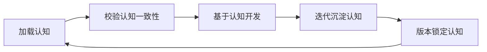

# 认知资产总览图谱（第六章 认知控制工程）

## 1. 认知体系整体结构
本项目AI认知由 **六层认知资产** + **版本基线** 构成，AI开发前必须完整加载：

1. **架构认知**（怎么建系统）
2. **业务认知**（业务铁律是什么）
3. **历史认知**（以前踩过什么坑、做过什么决策）
4. **约束认知**（什么绝对不能做）
5. **认知控制规则**（认知加载、一致性校验、刷新沉淀）
6. **运行治理资产**（红线、风险、流程、审计、人机卡点）
7. **版本基线**（context_version.yaml 锁定当前工程版本）

## 2. 所有认知资产目录清单

### 2.1 架构认知
| 文件 | 说明 |
|------|------|
| `architecture/module_map.md` | 模块目录结构、单据层次(上游/中游/下游/结算)、分层约束、外部依赖 |
| `architecture/dependency.yaml` | 模块依赖关系、模型调用图、跨模块方向约束 |

### 2.2 业务认知
| 文件 | 说明 |
|------|------|
| `business/stock_rule.md` | 双流程铁律、排期铁律、保税铁律、IFFM引用铁律、费用记录铁律、状态约束 |
| `business/inventory_flow.md` | 运输单据全生命周期(三型)、跨模块单据流、八场景流程映射 |

### 2.3 历史认知
| 文件 | 说明 |
|------|------|
| `history/sprint_shturl` | 每次迭代简快快照（变更摘要 + 验收状态） |
| `history/sprint_log.md` | 迭代详细日志（目标、成果表、问题与决策） |
| `history/decision_note.md` | 架构与业务决策记录（共12项决策） |
| `history/bug_record.md` | Bug记录（语法错误/缩进/模块前缀等） |

### 2.4 刚性约束认知
| 文件 | 说明 |
|------|------|
| `constraints/forbidden_change.yaml` | 架构层/数据层/功能层/安全层禁止规则 + soft_reference例外 + controller_bypass红线 |

### 2.5 认知控制规则
| 文件 | 说明 |
|------|------|
| `cognition/cognition_asset_map.md` | **本文件** — 认知资产总览图谱 |
| `cognition/cognition_rule.yaml` | 认知强制加载规则(8步)、一致性铁律、缺失拦截规则 |
| `cognition/cognition_consistency_check.yaml` | 架构/业务/历史决策/刚性约束四类一致性校验规则 |
| `cognition/cognition_refresh.yaml` | 认知刷新触发条件、沉淀四要素、版本升级规则 |

### 2.6 运行治理资产
| 文件 | 说明 |
|------|------|
| `governance/rules.yaml` | 静态红线（架构/业务/AI开发/安全四项不可违反） |
| `governance/risk_level.yaml` | 五级风险定义（LEVEL1 UI调整 → LEVEL5 致命变更） |
| `governance/human_loop.yaml` | 三级人机卡点（边界/架构/高危变更审批） |
| `governance/workflow_risk.yaml` | 流水线六步校验 + 自动熔断策略 |
| `governance/audit_spec.yaml` | 审计日志字段、覆盖范围、不可删除规则 |
| `governance/tool_governance.yaml` | AI工具调用行为约束（允许/禁止/前置检查） |
| `governance/bug_fix_workflow.yaml` | Bug修复标准7步工作流（登记→定级→修复→验证→闭环） |

### 2.7 迭代意图契约
| 文件 | 说明 |
|------|------|
| `intent/intent_contract.template.yaml` | 意图契约模板 |
| `intent/intent_sprint1_pickup_plan.yaml` | Sprint1: pickup.plan 提货需求基座 |
| `intent/intent_sprint2_calendar.yaml` | Sprint2: 排期日历调度系统 |
| `intent/intent_sprint3_arch_refactor.yaml` | Sprint3: transport.request 统一入口 |
| `intent/intent_sprint4_transport_order.yaml` | Sprint4: transport.order 收敛闭环 |
| `intent/intent_sprint5_fee_base.yaml` | Sprint5: 费用/费率底层底座 |
| `intent/intent_sprint6_fee_billing.yaml` | Sprint6: 费用模型重构 + 双向计费 |
| `intent/intent_sprint7_inquiry_quote_flow.yaml` | Sprint7: 商业报价流程完善 |
| `intent/intent_sprint8_plan_driven_flow.yaml` | Sprint8: 计划驱动链路闭环 |

### 2.8 版本基线
| 文件 | 说明 |
|------|------|
| `context_version.yaml` | 上下文版本管理中心（当前 v1.0.9） |

## 3. AI 标准认知执行闭环

## 4. 认知工程核心价值
解决大模型三大幻觉问题：
1. 不懂项目架构乱开发
2. 遗忘历史决策重复踩坑
3. 不懂业务规则乱写逻辑
