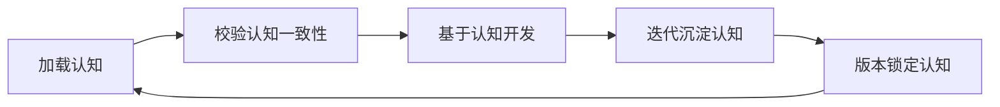

# 认知资产总览图谱（第六章 认知控制工程）

## 1. 认知体系整体结构
本项目AI认知由 **六层认知资产** + **版本基线** 构成，AI开发前必须完整加载：

1. **架构认知**（怎么建系统）
2. **业务认知**（业务铁律是什么）
3. **历史认知**（以前踩过什么坑、做过什么决策）
4. **约束认知**（什么绝对不能做）
5. **认知控制规则**（认知加载、一致性校验、刷新沉淀）
6. **运行治理资产**（红线、风险、流程、审计、人机卡点）
7. **版本基线**（context_version.yaml 锁定当前工程版本）

## 2. 所有认知资产目录清单

### 2.1 架构认知
|  | 可执行引擎：context_loader.py（认知加载）、verify.py（7门禁）、commit_guard.py（提交守卫）、odoo_check.py（模块验证） |
| 文件 | 说明 |
|------|------|
| `architecture/module_map.md` | 模块目录结构、单据层次(上游/中游/下游/结算)、分层约束、外部依赖 |
| `architecture/dependency.yaml` | 模块依赖关系、模型调用图、跨模块方向约束 |

### 2.2 业务认知
| 文件 | 说明 |
|------|------|
| `business/stock_rule.md` | 双流程铁律、排期铁律、保税铁律、IFFM引用铁律、费用记录铁律、状态约束 |
| `business/inventory_flow.md` | 运输单据全生命周期(三型)、跨模块单据流、八场景流程映射 |

### 2.3 历史认知
| 文件 | 说明 |
|------|------|
| `history/sprint_shturl` | 每次迭代简快快照（变更摘要 + 验收状态） |
| `history/sprint_log.md` | 迭代详细日志（目标、成果表、问题与决策） |
| `history/decision_note.md` | 架构与业务决策记录（共12项决策） |
| `history/bug_record.md` | Bug记录（语法错误/缩进/模块前缀等） |

### 2.4 刚性约束认知
| 文件 | 说明 |
|------|------|
| `constraints/forbidden_change.yaml` | 架构层/数据层/功能层/安全层禁止规则 + soft_reference例外 + controller_bypass红线 |

### 2.5 认知控制规则
| 文件 | 说明 |
|------|------|
| `cognition/cognition_asset_map.md` | **本文件** — 认知资产总览图谱 |
| `cognition/cognition_rule.yaml` | 认知强制加载规则(8步)、一致性铁律、缺失拦截规则 |
| `cognition/cognition_consistency_check.yaml` | 架构/业务/历史决策/刚性约束四类一致性校验规则 |
| `cognition/cognition_refresh.yaml` | 认知刷新触发条件、沉淀四要素、版本升级规则 |

### 2.6 运行治理资产
| 文件 | 说明 |
|------|------|
| `governance/rules.yaml` | 静态红线（架构/业务/AI开发/安全四项不可违反） |
| `governance/risk_level.yaml` | 五级风险定义（LEVEL1 UI调整 → LEVEL5 致命变更） |
| `governance/human_loop.yaml` | 三级人机卡点（边界/架构/高危变更审批） |
| `governance/workflow_risk.yaml` | 流水线六步校验 + 自动熔断策略 |
| `governance/audit_spec.yaml` | 审计日志字段、覆盖范围、不可删除规则 |
| `governance/tool_governance.yaml` | AI工具调用行为约束（允许/禁止/前置检查） |
| `governance/bug_fix_workflow.yaml` | Bug修复标准7步工作流（登记→定级→修复→验证→闭环） |

### 2.7 迭代意图契约
| 文件 | 说明 |
|------|------|
| `intent/intent_contract.template.yaml` | **v3.0** — 对齐 5.x Intent Driven AI Engineering 最终规范 |
| `intent/intent_sprint1~15.yaml` | 历史 Sprint 契约（沿用旧 v1.0 格式，可读兼容） |

### 2.8 Context Profiles（5.x 新增）
| 文件 | 说明 |
|------|------|
| `profiles/development.yaml` | Development Work Type 资产加载黑白名单 + 读取策略 |
| `profiles/maintenance.yaml` | Maintenance Work Type 资产加载黑白名单 + 读取策略 |
| `profiles/infrastructure.yaml` | Infrastructure Work Type 资产加载黑白名单 + 读取策略 |
| `profiles/governance.yaml` | Governance Work Type 资产加载黑白名单 + 读取策略 |

### 2.9 Intent 执行记录（5.x 新增）
| 文件 | 说明 |
|------|------|
| `intent_records/intent_xxx/` | 每 Intent 独立归档（decision/validation/defect/patch/summary） |

### 2.10 版本基线

### 2.10 版本基线
| 文件 | 说明 |
|------|------|
| `context_version.yaml` | 上下文版本管理中心（当前 v1.0.9） |

## 3. AI 标准认知执行闭环

## 4. 认知工程核心价值
解决大模型三大幻觉问题：
1. 不懂项目架构乱开发
2. 遗忘历史决策重复踩坑
3. 不懂业务规则乱写逻辑

## 5. Intent 分类管理体系（5.x 最终规范）

### 5.1 Work Type + Change Type 双层分类
按照 5.3 节规范，Work Type 分为四类：Development / Maintenance / Infrastructure / Governance。
每个 Work Type 配套独立 Context Profile（profiles/{work_type}.yaml），Profile 定义 include/exclude 过滤规则和 load_strategy 读取策略。
Intent 仅声明 asset_snapshot_profile 引用 Profile 标识，不直接指定文件路径、不控制读取权限。
Change Type 为二级变更动因统一枚举：New Feature / Change Request / Functional Bug Fix / Data Correction / Configuration Change / Performance Optimization / Legacy Migration / Architecture Upgrade / Compliance Review / Risk Audit。

| Work Type | Change Type 适配 | 适用场景 | Profile 域 | 快照体量 |
|------|--------|----------|-------------------|----------|
| **Development** | New Feature / Change Request / Functional Bug Fix / Legacy Migration | 业务功能迭代、逻辑修复 | 业务域 | 轻量 |
| **Maintenance** | Data Correction / Configuration Change / Performance Optimization / Legacy Migration | 存量数据修正、参数调整 | 轻量业务+配置 | 极轻量 |
| **Infrastructure** | Architecture Upgrade | 底层框架、PDF引擎、loader改造 | 基建域 | 极轻量 |
| **Governance** | Compliance Review / Risk Audit | 合规校验、风险巡检（只读不改） | 合规+业务基线 | 按需 |

| 分类 | 子类型 | 适用场景 | context_loader 域 | 快照体量 |
|------|--------|----------|-------------------|----------|
| **Development** | New Feature / Change Request / Functional Bug Fix | 业务代码迭代、字段调整、逻辑修复 | 业务域（订单/CMR/货品规则） | 轻量 |
| **Infrastructure** | （自有子类型） | 底层框架、loader迭代、PDF生成、工具改造 | 基建域（脚本/工具/配置） | 极轻量 |
| **Audit** | （自有子类型） | 合规校验、数据核对、风险巡检（只读不改） | 业务域 + 合规域 | 按需 |

### 5.2 生命周期闭环（Intent Execution Loop）

- **Intent**: 绑定 Profile，设定 loop_policy + validation_strategy
- **Implement**: 严格懒加载，仅快照常驻，原文临时调取，遵循 Profile 读取权限
- **Engineering Validation Loop**: 分层校验（static → build → auto_test → runtime → business → human），失败时增量局部重试
- **Correct**: retry_scope 限定仅加载缺陷关联资产，不重建全量快照
- **Accepted → Asset Proposal**: 自动生成提案 + 完整执行记录
- **Human Asset Review**: 人工复核，通过则 Merge 更新基线，驳回则退回修正

### 5.3 资产绑定规则
- 强绑定：Intent 必须勾选依赖的 Domain 资产，未绑定资产完全不加载
- 懒加载：绑定资产仅摘要快照常驻，完整原文按需读取
- 分类隔离：Development 仅绑定业务资产，Infrastructure 仅绑定基建资产，Audit 绑定业务+合规
- 解绑：Accept 后清除本次快照，新 Intent 重新绑定

### 5.4 沉淀规则（按类型）
- 整体流程：ACCEPTED → Asset Proposal → Human Asset Review → Merge Asset / 驳回修正
- **Development / Maintenance / Infrastructure**: 代码/配置归档 + 摘要入快照库 + 故障教训入风险资产
- **Governance**: 合规校验项 + 核查标准入合规资产（无代码变更产出）
- 所有沉淀仅存摘要/规则/配置元数据，不冗余存储完整文件
- 每次沉淀更新对应 Domain 资产版本号

### 5.5 相关文件
| 文件 | 说明 |
|------|------|
|  | **v2.0** — 升级后模板（含分类/绑定/交付/风险字段） |
|  | 历史契约（沿用旧格式，可读兼容） |
|  | 认知加载规则（含分类检查） |
|  | 按 intent_type 沉淀规则 |
|  | 类型一致性校验 |

